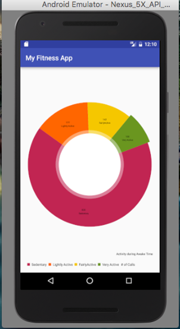
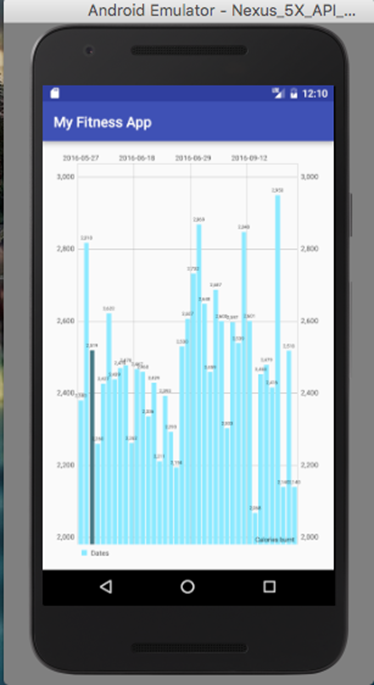
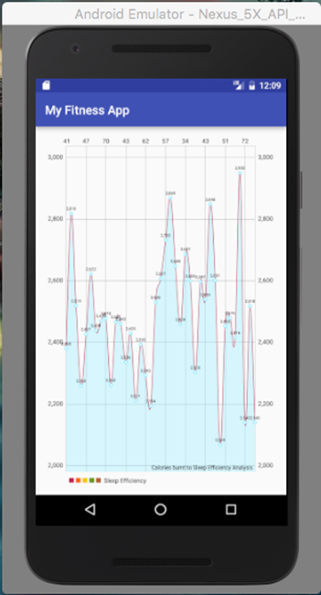
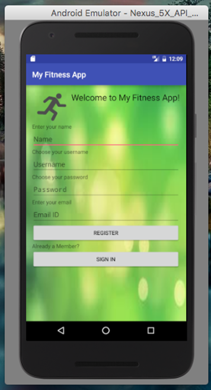

# My Fitness App

 “My Fitness App” is a health data visualization app that lets users co-relate different health data parameters and visualize it in graphs.

## Synopsis

   An Android app for custom visualization of health-data collected from wearable devices. Enriched app using Google Analytics to capture and analyze popular features of the app and user demographic.

## App running

All the graphs are interactive. They can be zoomed in and out by pinching the screen.

#### Activity in a day

#### Calorie Burn over time

#### Sleep over Calories Burnt

#### Registration

## Motivation

To be able to customize visualization of health data

## API Reference

Created API for authentication in PHP

## License

Pavani Vellal @2017
